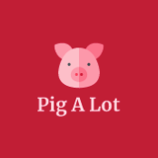

# SnacksApp

### *Install procedure at end of this page* 

# **About Our Project** 

<!--  -->

<!-- <a href="https://NETLIFY LINK" target="_blank">Click here - PigALot App</a> -->

"Pig A Lot" is a unique twist on a snack app that deviates from the typical focus on healthy eating. Instead, this app celebrates greasy and indulgent food options that are often considered unhealthy.
 
The backend of the application requires the implementation of a RESTful server that can perform CRUD (Create, Read, Update, Delete) actions on a single resource. The resource is represented by a database table called "snack," which includes fields such as name, category, rating, calories, and various Boolean flags for vegan, halal, and favorite options. The table also incorporates constraints, such as rating being limited to a range of 0 to 5.
                
The backend feature requirements include creating routes for creating new resources, reading all resources, reading a single resource, updating a single resource, and deleting a single resource. Proper "Not Found" responses should be provided for routes that don't match the predefined routes.
               
On the frontend side, a React application was developed to facilitate CRUD operations on the snack resource. The application displays the data in a thoughtful and clear manner. All pages feature a navigation bar with the application name and a button to create a new snack resource.
                 
Key frontend feature requirements included an Index page to list all the snack resources, a Show page to provide detailed information about a specific snack, and a form page to create and edit snack resources. The forms have appropriate labels and input types, and when submitted, the data is stored or updated in the database. The Show page has buttons to edit or delete the current snack, providing confirmation prompts where necessary.
             
By meeting the backend and frontend requirements, the "Pig A Lot" app provides a fun and engaging experience for users who appreciate indulgent snack options.
          
The app also includes this "About" page where users can learn about the project and its developers. This page contains a brief project description, as well as a short bio for each teammate and links to their GitHub accounts. The "About" page can be accessed through the navigation bar that appears on every page of the app.
  

## App Screenshots

<!--  -->
### The Home Screen

|  |
|-|

### Individual Snack Page

|  |
|-|

### New Snack Page

|  |
|-|

  
## 😁 Meet the Team 😁

### Wil Santos

I'm currently a Full Stack Web Development Fellow at Pursuit, a 12-month, Google-funded software engineering fellowship with a 9% acceptance rate whose graduates have been hired as developers at leading companies such as Pinterest, JP Morgan, Citi, Spotify, and Blackstone.
    
I'm currently learning Express, having already studied React, JavaScript, HTML & CSS and I am training to become a software engineer so that I can solve real-world problems.

<!-- [GitHub](https://github.com/Wilsantos1975){:target="_blank rel="noopener"} -->
<a href="https://github.com/Wilsantos1975" target="_blank">GitHub</a>
<a href="https://www.linkedin.com/in/fausto-wilghen-santos-9083a9112" target="_blank">LinkedIn</a>
  

### Mark Roberston

I'm currently a Full Stack Web Development Fellow at Pursuit, a 12-month, Google-funded software engineering fellowship with a 9% acceptance rate whose graduates have been hired as developers at leading companies such as Pinterest, JP Morgan, Citi, Spotify, and Blackstone. I'm currently learning Express, having already studied React, JavaScript, HTML & CSS and I am training to become a software engineer so that I can solve real-world problems. When I'm not coding, I enjoy movies, watching Formula 1 racing, music, travel and playing with my German Shepherd. Being a Pursuit Fellow will give me the foundation to go on and learn new and exciting languages such as Python, C++, C# et al. that I would like to use both personally and professionally. My first personal project will be to design and implement a quantitative trading algorithm that I can run through an API to a trading platform. I would very much enjoy working for a start-up (as I have start-up experience) or even a large financial firm, as my experience up until Pursuit has been in the financial markets.

<a href="https://github.com/MarkRobertson67" target="_blank">GitHub</a>
<a href="https://www.linkedin.com/in/mark-robertson-ny-uk" target="_blank">LinkedIn</a>
  

<a href="https://trello.com/invite/b/q3MjafJY/ATTI5ec278cb24bf01d48f6285b2ddf24ce9D74B7E3C/snacks-simple-project-board" target="_blank">Trello Board</a>

<a href="https://lucid.app/lucidchart/b4a7f661-b0e1-4ae8-b8d8-744fc2f7ca0d/edit?viewport_loc=-387%2C-17%2C2736%2C1355%2C0_0&invitationId=inv_cc436efd-3923-431e-8c96-ff955f0cb6d6" target="_blank">Lucid Wireframe</a>

# **How to install** 

Welcome again to the PigOut Snacks App! This guide will walk you through the installation and setup process to get the app up and running on your local machine.

## **Prerequisites**

Before you begin, please ensure that you have the following software installed on your machine:

- Node.js: Install Node.js from the official website: https://nodejs.org
- PostgreSQL: Install PostgreSQL from the official website: https://www.postgresql.org

# **Installation**

## **Back-end**

1.  Clone the repository:   git clone <repository URL>
2.  Navigate to the back-end directory: cd back-end
3.  Install the back-end dependencies:  npm install
4.  Create a .env file in the back-end directory and configure the following environment variables:  
PORT=2525 
PG_HOST=localhost 
PG_PORT=5432 
PG_DATABASE=snacks 
PG_USER=postgres 
5.  Make sure to include in your .gitignore file:   node_modules
.env
.DS_Store
5.  Start the back-end server:  npm start, which will actually start Front and back-end.

## **Front-end**

1.  Open a new terminal window and navigate to the front-end directory: cd ../front-end
2.  Install the front-end dependencies: npm install
3.  Create a .env file in the front-end directory and configure the following environment variables: REACT_APP_API_URL=http://localhost:2525
4.  Make sure to include in your .gitignore file:   node_modules
.env
.DS_Store
5.  Start the front-end development server: npm start
This will start the front-end server at http://localhost:3000.
6.  Access the app in your web browser: Open your preferred web browser and visit http://localhost:3000 to see the PigOut Snacks App in action.

# **Database**

To connect to the database and view the tables:

1.  Open the PostgreSQL command line interface by running the following command:   
        1.  psql -U postgres -f db/schema.sql 
        2.  psql -U postgres -f db/seed.sql
        3.  Alternatively: to start the db, npm run db:start & to shutdown the db, npm run db:shutdown

2.  Once logged in, you can view the list of tables by running the following command: \dt
3.  To view the contents of a specific table, use the following command:    SELECT * FROM snack;

That's it! You should now have the PigOut Snacks App installed and running on your local machine. Enjoy exploring and indulging in the world of greasy and indulgent snacks!

